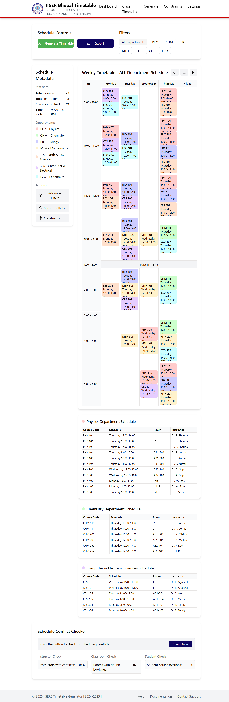

# ScheduleMaster - Timetable Generator


## Overview
A modern web application for generating and managing academic timetables at IISER Bhopal.



## Features

### 🚀 Core Features
- Automated timetable generation
- Interactive visualization
- Multi-department support
- Real-time conflict detection

### 📊 Visualization Features
- Weekly calendar view
- Department-wise filtering
- Drag-and-drop interface
- Resource utilization stats


## Tech Stack

### Frontend
- React 18
- TypeScript
- TailwindCSS
- Shadcn/ui Components

### Backend
- Node.js
- Express
- SQLite
- RESTful API

## Installation

```bash
# Clone repository
git clone https://github.com/RavindranathTagor/timetable_generator.git
cd timetable_generator

# Install dependencies
npm install

# Install client dependencies
cd client
npm install
```

## Development Setup

```bash
# Start backend server
npm run server

# Start frontend (new terminal)
npm run client
```

Access the application at `http://localhost:5000`

## Project Structure

```
ScheduleMaster/
├── client/                # Frontend React application
│   ├── src/
│   ├── public/
│   └── index.html
├── server/                # Backend Express server
├── screenshots/           # Application screenshots
└── README.md
```

## Screenshots

### Dashboard


### Timetable View


### Export Options


## Contributing

1. Fork the repository
2. Create feature branch (`git checkout -b feature/amazing-feature`)
3. Commit changes (`git commit -m 'Add amazing feature'`)
4. Push to branch (`git push origin feature/amazing-feature`)
5. Open a Pull Request


